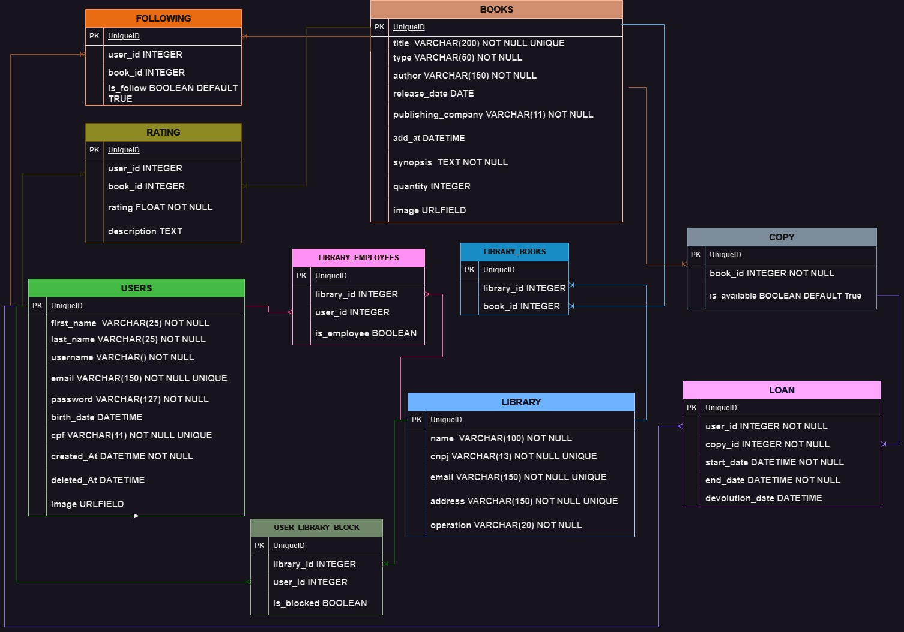

# BiblioteKa

### The application is a Restful API that aims to manage information related to the operation of various libraries.

To run the application, follow these steps.

1. Create your virtual environment:

```bash
python -m venv venv
```

2. Active your venv:

```bash
# Linux:
source venv/bin/activate

# Windows (Powershell):
.\venv\Scripts\activate

# Windows (Git Bash):
source venv/Scripts/activate
```

3. Install all requirements:

```bash
pip install -r requirements.txt
```

4. Run the migrations:

```bash
python manage.py makemigrations
```

```bash
python manage.py migrate
```

5. Run the server:

```bash
python manage.py runserver
```

6. Access the documentation to view and test all routes

```bash
http://127.0.0.1:8000/api/docs/
```

## BiblioteKa Diagram



# ERRORS CASE

- **_USERNAME_**, **_USER EMAIL_**, **_USER CPF_** and **_LIBRARY CNPJ_** must be unique. With that, if someone tries to create a new user or library, the server will return the following message:

    | **SERVER RETURN:** |
    | ------------------ |
    | Body: Format Json  |
    | Status Code: 400 _BAD REQUEST_ |

    ### **USERS:**
    ```json
    {
        "email": [
            "This field must be unique."
        ],
        "cpf": [
            "user with this cpf already exists."
        ],
        "username": [
            "A user with that username already exists."
        ]
    }
    ```
    ### **LIBRARIES:**
    ```json
    {
        "cnpj": [
            "This field must be unique."
        ]
    }
    ```

- If you are trying to create a new user or a new library and you forget a field or you typed something wrong in the field, the server will return the following message:

    | **SERVER RETURN:** |
    | ------------------ |
    | Body: Format Json  |
    | Status Code: 400 _BAD REQUEST_ |

    ```json
    {
        "first_name": [
            "This field is required."
        ],
        "cpf": [
            "Ensure this field has no more than 11 characters."
        ]
    }
    ```

- Some routes need authentication, if you try to access them and you don't have permission, the server will return this message: 

    | **SERVER RETURN:** |
    | ------------------ |
    | Body: Format Json  |
    | Status Code: 403 _Forbidden_ |

    ```json
    {
	    "detail": "You do not have permission to perform this action."
    }
    ```

- In routes that must be passed search parameters, they can return the following message if the parameter is not found.

    | **SERVER RETRUN:** |
    | ------------------ |
    | Body: Format Json  |
    | Status Code: 404 _not found_ |

    ```json
    {
        "detail": "Not found."
    }
    ```

- In login route, if you pass wrong **_USERNAME_** and/or wrong **_PASSWORD_**, the server is return: 

    | **SERVER RETURN:** |
    | ------------------ |
    | Body: Format Json  |
    | Status Code: 401 _Unauthorized_ |

    ```json
    {
	    "detail": "No active account found with the given credentials"
    }
    ```
# **LIBRARY**

### ENDPOINTS

| METHOD    | ENDPOINTS| RESPONSIBILITY|
| - | - | - |
| **GET** | /libraries/ | List all libraries|
| **GET** | /libraries/:id/ | List library by ID|
| **GET** | /libraries/:id/books/ | List all library's books |
| **GET** | /libraries/:id/loans/ | List all library's loans |
| **GET** | /libraries/:id/employee/ | List all library's employees |
| **GET** | /libraries/:id/users/block/ | List all library's users blocked|
| **POST** | /libraries/create/ | Create a library |
| **PATCH** | /libraries/:id/ | Update informations for library |


## REQUEST RETURN

### **GET /libraries/**

- List all libraries

    - Validation by token;
    - Only general manager can list all libraries;


    ### **RETURN EXAMPLE:**
    ```json
    {
        "count": 1,
        "next": null,
        "previous": null,
        "results": [
            {
                "id": 1,
                "name": "Library 1",
                "cnpj": "00000000000000",
                "email": "library@mail.com",
                "address": "Street, N, City/UF",
                "employees": [
                    {
                        "id": 1,
                        "first_name": "John",
                        "last_name": "John",
                        "email": "john@mail.com",
                        "birth_date": "YYYY-mm-ddTHH:MM:SSZ",
                        "cpf": "00000000000",
                        "username": "John",
                        "is_superuser": false,
                        "image": "https://image.com/image.png"
                    }
                ],
                "books": [
                    {
                        "id": 1,
                        "title": "O Poder do Hábito",
                        "type": "saude",
                        "author": "Charles Duhigg",
                        "synopsis": "Charles Duhigg, repórter investigativo do New York Times, mostra que a chave para o sucesso é entender como os hábitos funcionam - e como podemos transformá-los.",
                        "release_date": "2012-09-24",
                        "publishing_company": "Objetiva",
                        "add_at": "2023-07-08T13:43:51.433669Z",
                        "quantity": 1,
                        "copies": [
                            {
                                "id": 1,
                                "book": 1,
                                "is_available": true
                            }
                        ]
                    }
                ]
            }
        ]
    }
    ```

### **GET /libraries/:id/**


- List library by ID
    - Validation by Token;
    - Only Admins and Employees can list them library;
    
    ### **RESULT EXAMPLE:**
    ```json
    {
        "id": 1,
        "name": "Library 1",
        "cnpj": "00000000000000",
        "email": "library@mail.com",
        "address": "Street, N, City/UF",
        "employees": [
            {
                "id": 1,
                "first_name": "John",
                "last_name": "John",
                "email": "john@mail.com",
                "birth_date": "YYYY-mm-ddTHH:MM:SSZ",
                "cpf": "00000000000",
                "username": "John",
                "is_superuser": false,
                "image": "https://image.com/image.png"
            }
        ],
        "books": [
            {
                "id": 1,
                "title": "O Poder do Hábito",
                "type": "saude",
                "author": "Charles Duhigg",
                "synopsis": "Charles Duhigg, repórter investigativo do New York Times, mostra que a chave para o sucesso é entender como os hábitos funcionam - e como podemos transformá-los.",
                "release_date": "2012-09-24",
                "publishing_company": "Objetiva",
                "add_at": "2023-07-08T13:43:51.433669Z",
                "quantity": 1,
                "copies": [
                    {
                        "id": 1,
                        "book": 1,
                        "is_available": true
                    }
                ]
            }
        ]
    }
    ```

### **GET /libraries/:id/books/**

- List all library's books
    - Validation by token;
    - Only authenticated users can list expecif library books;

    ### **RETURN EXAMPLE:**
    ```json
    {
	"count": 1,
	"next": null,
	"previous": null,
	"results": [
        {
            "id": 1,
            "title": "O Poder do Hábito",
            "type": "saude",
            "author": "Charles Duhigg",
            "synopsis": "Charles Duhigg, repórter investigativo do New York Times, mostra que a chave para o sucesso é entender como os hábitos funcionam - e como podemos transformá-los.",
            "release_date": "2012-09-24",
            "publishing_company": "Objetiva",
            "add_at": "2023-07-08T13:43:51.433669Z",
            "quantity": 1,
            "copies": [
                {
                    "id": 1,
                    "book": 1,
                    "is_available": true
                }
            ]
        }
    ]
    }
    ```

### **GET /libraries/:id/employee/**

- List all library's employees
    - Validation by token;
    - Only authenticated users can list all library employees

    ### **RETURN EXAMPLE:**
    ```json
    {
        "count": 1,
        "next": null,
        "previous": null,
        "results": [
            {
                "id": 1,
                "first_name": "John",
                "last_name": "John",
                "email": "john@mail.com",
                "birth_date": "YYYY-mm-ddTHH:MM:SSZ",
                "cpf": "00000000000",
                "username": "John",
                "is_superuser": false,
                "image": "https://image.com/image.png"
            }
        ]
    }
    ```

### **GET /libraries/:id/loans/**

- List all library's loans
    - Validation by token;
    - Only Admin and Employees can list all library loans;
    - Administrators and employees can only list loans from your library;

    ### **RETURN EXAMPLE:**
    ```json
    {
        "count": 1,
        "next": null,
        "previous": null,
        "results": [
            {
                "id": 1,
                "first_name": "John",
                "last_name": "John",
                "email": "john@mail.com",
                "birth_date": "YYYY-mm-ddTHH:MM:SSZ",
                "cpf": "00000000000",
                "username": "John",
                "is_superuser": false,
                "image": "https://image.com/image.png"
            }
        ]
    }
    ```

### **GET /libraries/:id/users/block/**

- List all libraries loans
    - Validation by token;
    - Only Admins and Employees can list libraries blocked users;
    - Administrators and employees can only list blocked users from your library;

    ### **RETURN EXAMPLE:**
    ```json
    {
        "count": 1,
        "next": null,
        "previous": null,
        "results": [
            {
                "id": 1,
                "first_name": "John",
                "last_name": "John",
                "email": "john@mail.com",
                "birth_date": "YYYY-mm-ddTHH:MM:SSZ",
                "cpf": "00000000000",
                "username": "John",
                "is_superuser": false,
                "image": "https://image.com/image.png"
            }
        ]
    }
    ```

### **POST /libraries/create/**

- Create library
    - Validation by token;
    - Only general manager can create libraries;

    ### **REQUEST BODY:**
    ```json
    {
        "name": "Library 1",
        "cnpj": "00000000000000",
        "email": "library@mail.com",
        "address": "Street, N, City/UF"
    }
    ```

    ### **RETURN EXAMPLE:**
    ```json
    {
        "id": 1,
        "name": "Library 1",
        "cnpj": "00000000000000",
        "email": "library@mail.com",
        "address": "Street, N, City/UF",
        "employees": [],
        "books": []
    }
    ```

### **PATCH /libraries/:id/**

- Update informations from library
    - Validation by token;
    - Only Admins can update library information;
    - Admin can only update his library information;

    ### **REQUEST BODY:**
    ```json
    {
        "name": "Library2"
    }
    ```

    ### **RETURN EXAMPLE:**
    ```json
    {
        "id": 1,
        "name": "Library 2",
        "cnpj": "00000000000000",
        "email": "library@mail.com",
        "address": "Street, N, City/UF",
        "employees": [],
        "books": []
    }
    ```

